# 8-bit-computer

## Modular Description

1. [ System Clock ](#desc)  
     1.1 [Astable Clock ](#astable)  
     1.2 [Monostable Clock ](#monostable)  
     1.3 [Bistable Clock ](#bistable)  
     1.3 [Clock Selector ](#selector)  
    
2. [ Memory ](#memory)  
     2.1 [RAM ](#RAM)  
     2.2 [Memory Address Registers](#MAR)  
     2.3 [Instruction Register ](#IR)  
     2.4 [Register A/B](#RegisterA)   
     2.5 [Microcode Storage](#micro)  
     
3. [ALU](#alu)  

4. [Program Counters ](#ProgramCounter)  

5. [Output Display ](#output)  

6. [Assembly Program](#assembly)

6. [Demonstration ](#demo)   

7. [References ](#refs)  

### 1. System Clock  
   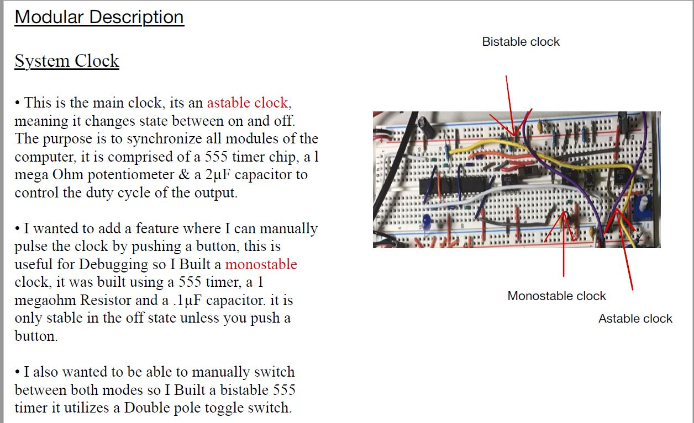

### Astable clock
   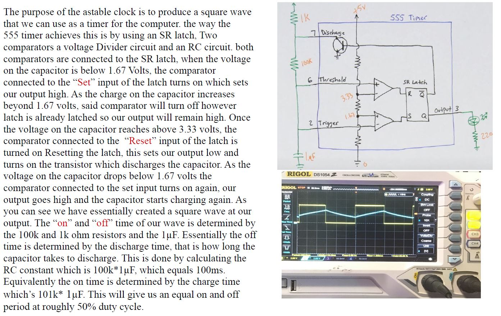

### Monostable clock
   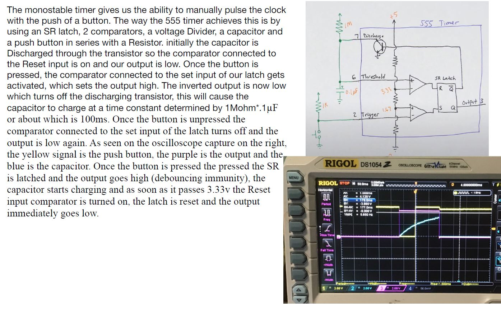

### Bistable clock
   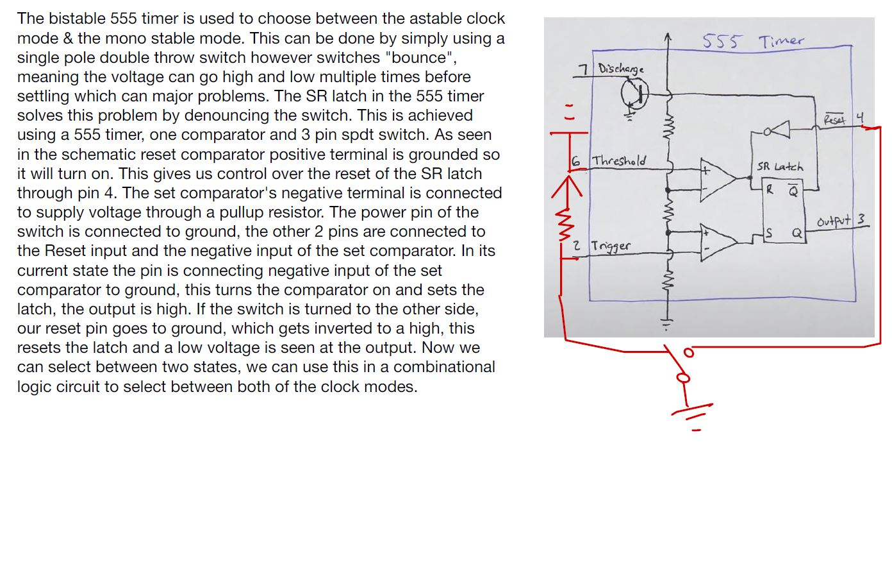
   

### Clock Selector
   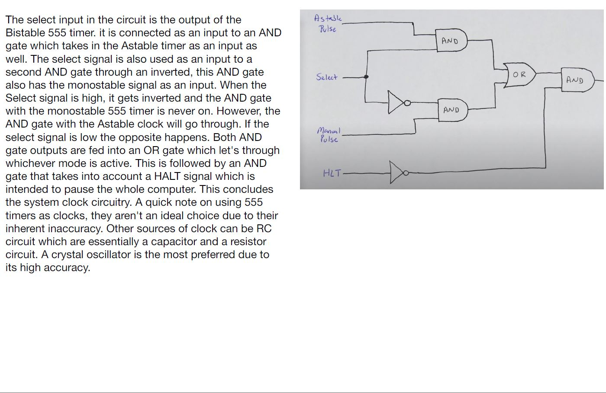

### 2. Memory
   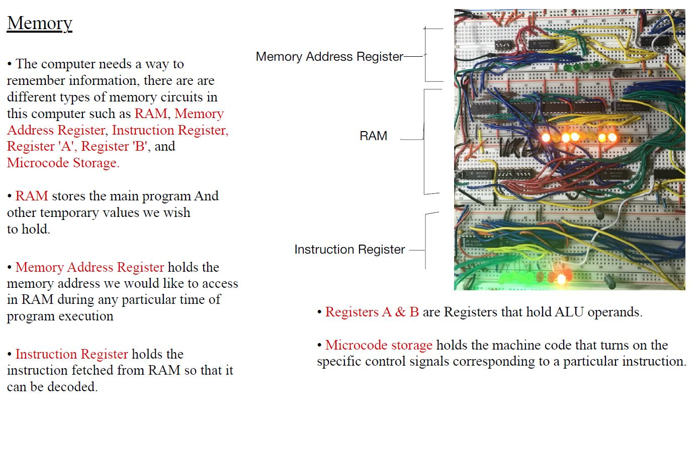

### Random Access Memory
   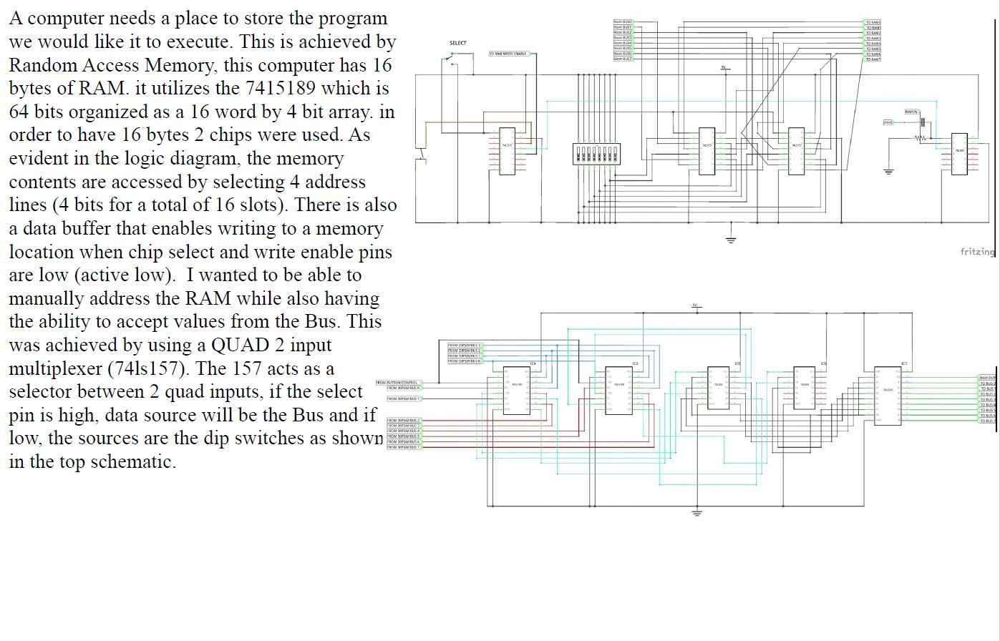
     

### Memory Address Register
   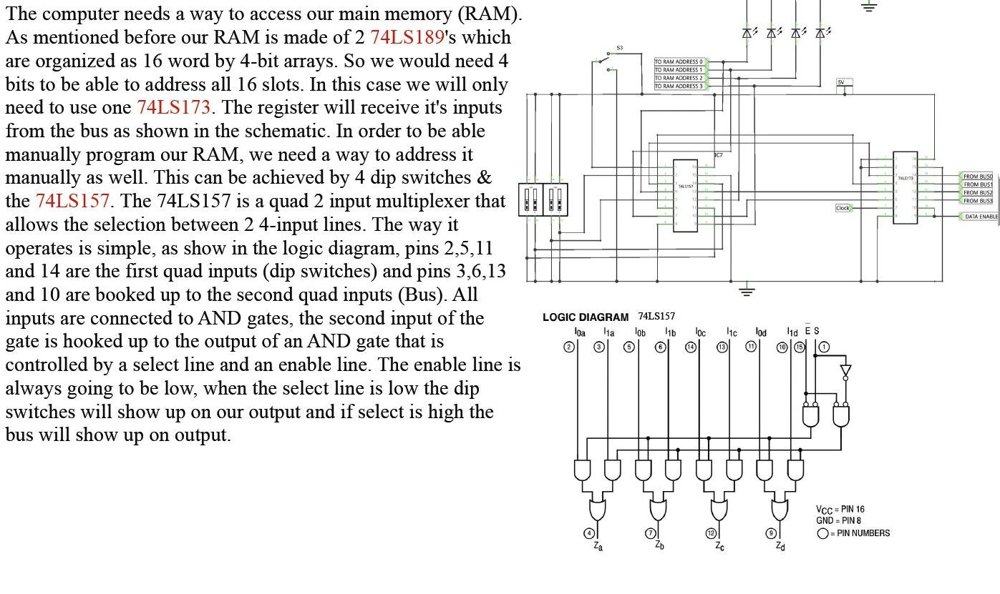
   

### Instruction Register
   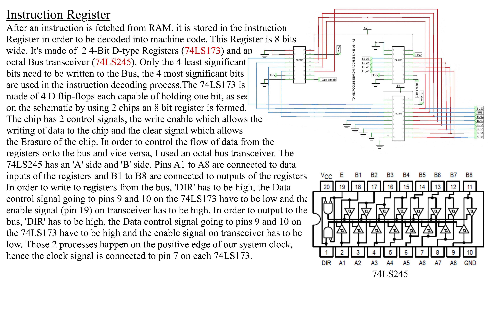

### Register A/B
   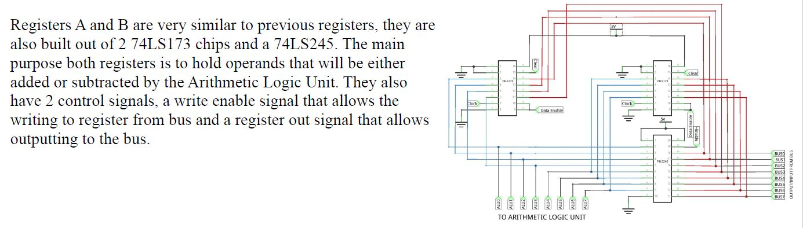
    

### Microcode Storage
   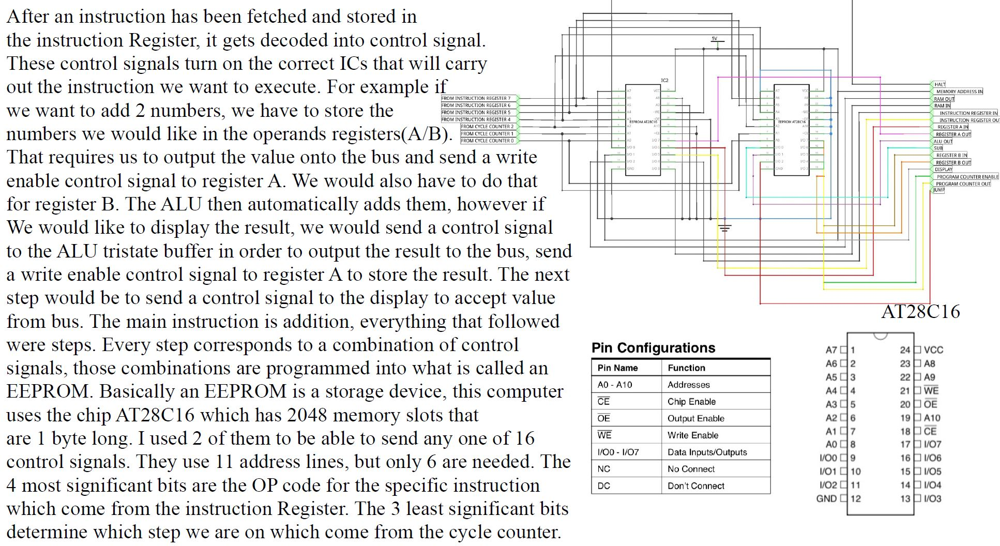
   

### 3. ALU
   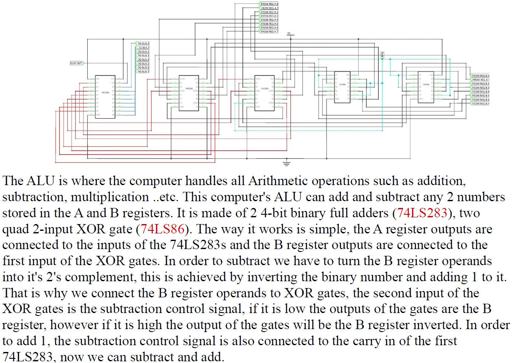
   
  
### 4. Program Counters
   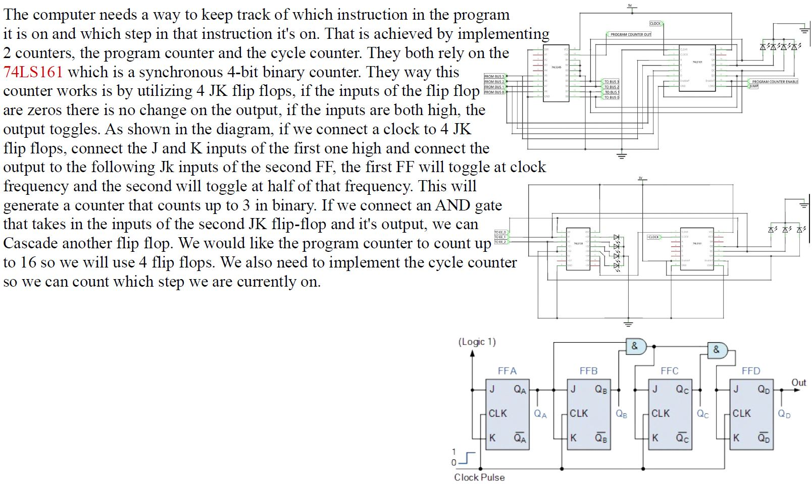

  
### 5. Output Display
   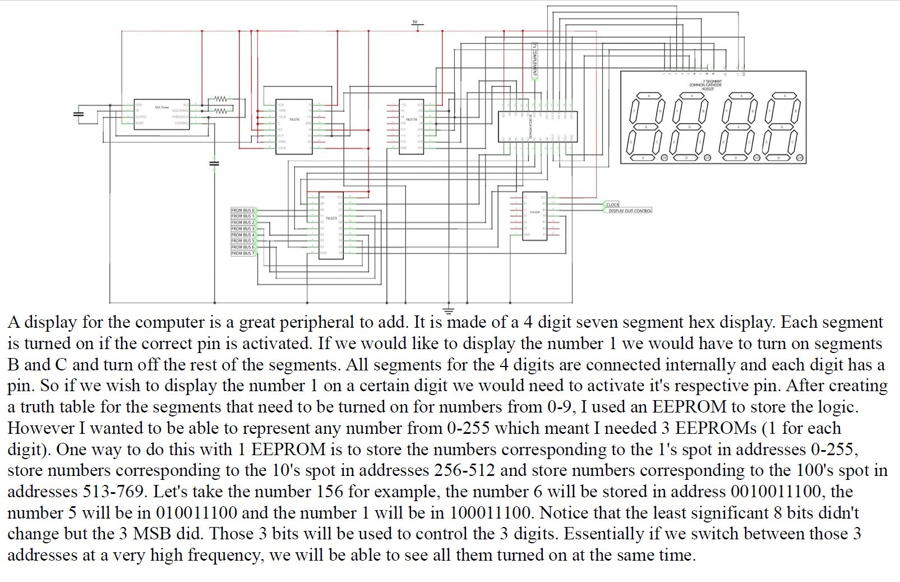
   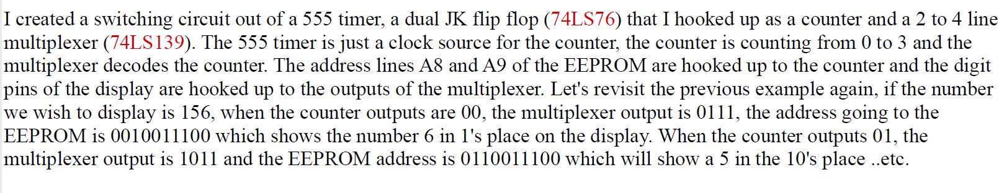
   
  
### 5. Assembly Program
   
   
   This program initially stores the number 1 in Register A and B, stores the sum back in Register A, outputs the sum to the display, increments Register A by 1 and outputs to the display again in an infinite loop which essentially creates an up counter. In order for the computer to execute any instruction, it needs an algorithm. an algorithm is several steps that are intended to tell the computer what we need it to do. At the most fundamental level, those steps are nothing but control signals, zeros and ones which the computer can understand. For example if we want to output the contents of a register onto the bus, we tell the computer to send a control signal to the register or module we would like to ouput to the bus. By looking at the table above, the first instruction is the *"Fetch"*, this intruction happens in steps 000 and 001 of every instruction. On step 0 i simply told the computer to send a control signal to activate the Memory Address Register and a control signal to the Program Counter, the Program Counter will output its contents on the bus (the number of instruction its currently on) and the MAR will store that so we can address ram and fetch said instruction. In the following step of the Fetch instruction, i told the computer to send a "RAM OUT" control signal to RAM, an "Instruction Register In" signal to the IR, and a "Program Counter Enable" signal to the PC, this tells RAM to output the instruction on the bus and tells the instruction register to store it and finally to enable the program counter for the next instuction. (stick with me it gets a little exciting in just a second)
   
   As mentioned before, i would like to create a counter. The next Instruction would be to load Register A (LDA) with the number 1. Lets first look at the anatomy of an instruction so i can explain how the decoding happens. The *LDA* instruction is 0001 1110 as shown in the table above. The 4 MSB's (most significant bits) are the op code for the instruction we would like to carry out, the 4 LSB's are used as an address to RAM in case the instruction we are on requires the computer to want to access a register in RAM again for some value we stored, in this case the number 1. In LDA step 010, we see that the computer will send an MI signal and a IO signal, meaning the Instruction register will output its 4 LSB's (the 4 MSB's go to the Microcode storage address lines) to the bus and the Memory Address Register will store that value which is 1110, this the address of the register in RAM that i stored the number 1 in. Th next step in LDA instruction is 011, in this step i told the computer to send an RO signal and an AI signal, this instructs the computer to ouput the contents of Register (1110) in RAM and for Register *A* to store said contents. Step 100 will just be an empty cycle in order to keep every instruction 3 cycles long. (this can be optimized for faster program execution)
   
   The third instruction is the *ADD*. This is straighforward, we simply access register 1111 in RAM and store the contents in Register *B* so that it can be Added to register *A*. Now its important to note that, the number 1 is stored in both Registers A and B, therefore the sum which 2 is to stored in the ALU. The following instruction which *OUT*, on step 010 i told the computer to send a control signal to the ALU and a signal to register A, this outputs the Sum to the bus and tells Reg A to store it. Its also important to note that now, since the contents of reg A is 2, the new sum in the ALU is 3 (since reg B contents are still 1). On step 011 i simply told the computer to output the contents of reg A and activated the output display. The next instruction is the *Jump* which is where the magic happens. I told the computer to send an MI signal and an IO signal, this will output the 4 LSB's of the IR to the bus and the MAR will store it. In register 1101 in RAM i stored the number 0000 0010 (2). In step 011 of the Jump instruction i told the RAM to output that value to the bus and the program counter to store it, this will load the program counter with the number 2 which will make us jump back to the *OUT* instruction, hence the infinite loop. This program will keep incrementing until the number 255 (8 bits), after it will reset back to zero and count up again. (For those of you who have read this far, i would like to thank you and personally invite you to my next section where i have a Jaw dropping video demonstration). 

  
### 5. Demonstration

### 6. References
     Digital Computer Electronics by Albert Paul Malvino
     https://eater.net/8bit/
